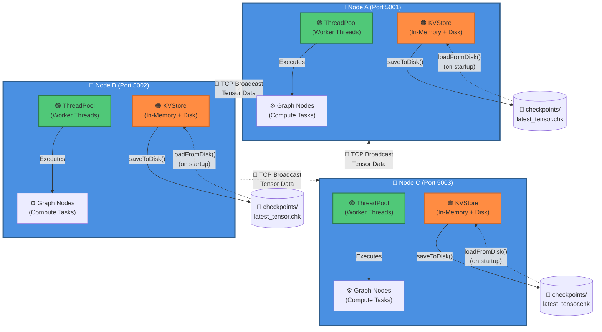

# Distributed AI Runtime

## Project Highlights

✅ Complete C++17 distributed tensor operations system  
✅ ThreadPool-based concurrent execution  
✅ Fault-tolerant networking with dead socket removal  
✅ Disk-backed checkpointing (KVStore)  
✅ Neural execution graph with parallel node execution  
✅ TCP-based tensor broadcasting  
✅ Task scheduling system

## Architecture

**Components:**

- **🔷 Node (Blue)**: Distributed compute node with TCP server
- **🟢 ThreadPool (Green)**: Concurrent task execution with worker threads
- **🟠 KVStore (Orange)**: In-memory tensor storage with disk persistence
- **⚙️ Graph Nodes**: Execution graph for neural computation
- **🔴 Broadcast (Red arrows)**: TCP-based tensor distribution between nodes
- **💾 Checkpoints**: Disk-backed tensor serialization

## Overview

A C++ distributed AI runtime prototype supporting:

- Multi-node tensor broadcast
- Thread-pool task scheduling
- Disk-backed checkpointing
- Minimal neural execution graph

This project demonstrates distributed systems engineering, concurrency, and ML infrastructure in a single, internship-ready repository.

## Screenshots

### Tensor Broadcast & Network Communication

*Multi-threaded tensor broadcasting between nodes over TCP with fault-tolerant socket management*

### Graph Execution

*Parallel execution of computation graph nodes via ThreadPool with thread IDs displayed*

### Checkpoint System

*Disk-backed tensor checkpointing with binary serialization (TENS format)*

