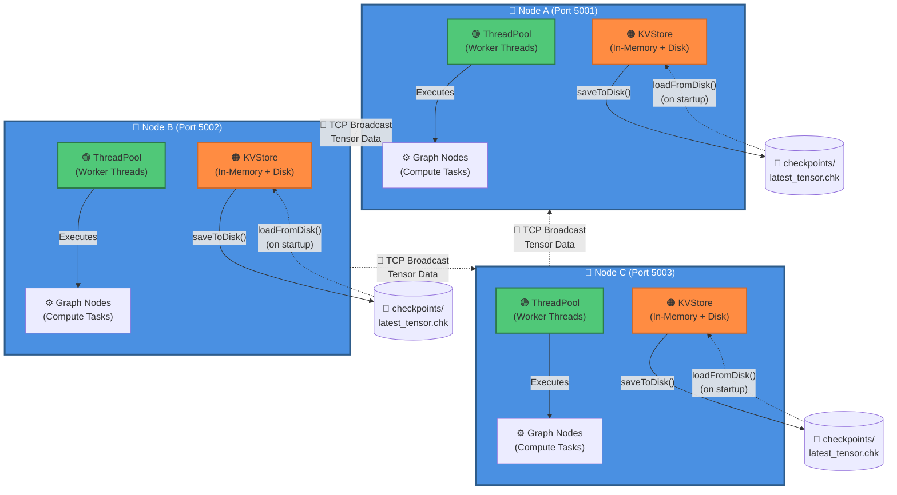

# Architecture Diagram

## Components

- **🔷 Node (Blue)**: Distributed compute node with TCP server
- **🟢 ThreadPool (Green)**: Concurrent task execution with worker threads
- **🟠 KVStore (Orange)**: In-memory tensor storage with disk persistence
- **⚙️ Graph Nodes**: Execution graph for neural computation
- **🔴 Broadcast (Red arrows)**: TCP-based tensor distribution between nodes
- **💾 Checkpoints**: Disk-backed tensor serialization

## Data Flow

1. Client threads send tensors to Node's TCP server (port 5001)
2. Node stores tensor in KVStore and calls `saveToDisk()`
3. ThreadPool executes compute tasks on received tensors
4. Graph nodes run concurrently via ThreadPool
5. Nodes broadcast tensors to connected peers over TCP
6. On startup, nodes restore state via `loadFromDisk()`
